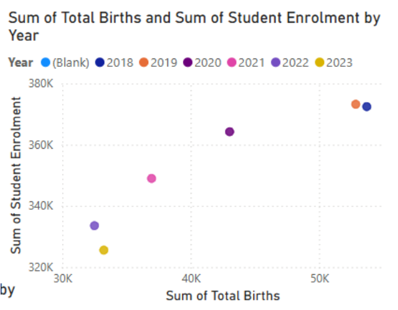
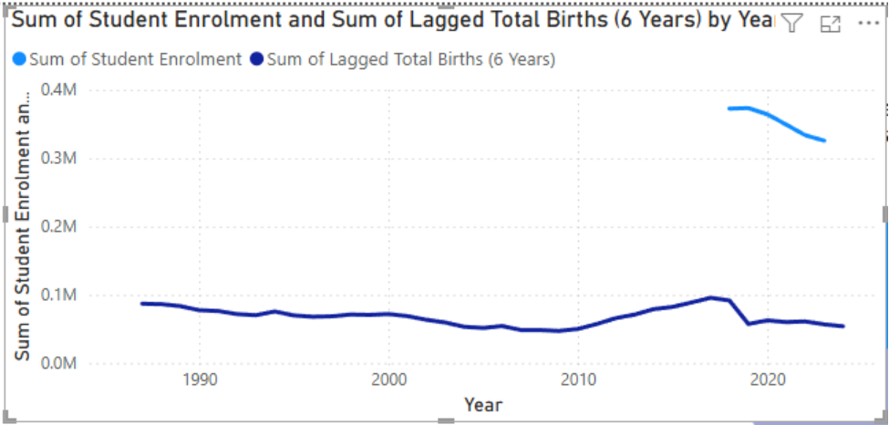
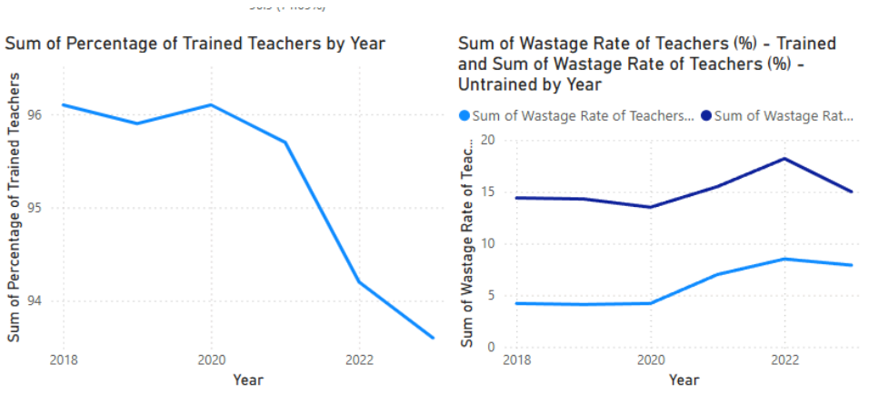
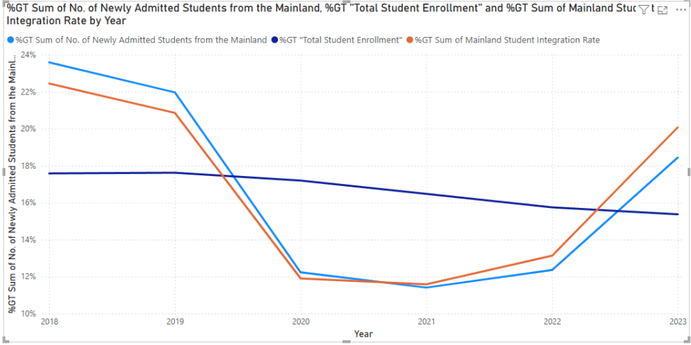
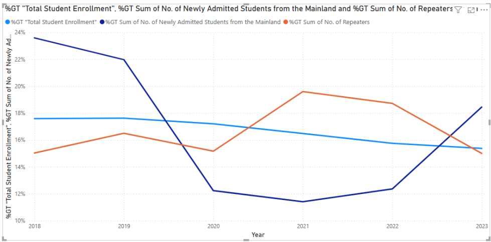

# Exploring the Relationship Between Birth Rate Fluctuations and Primary School Enrollment Trends in Hong Kong

This repository investigates how changes in Hong Kong’s birth rates affect primary school enrollment trends, with a focus on understanding the lagged impact of demographic shifts on the education system. By analyzing historical birth and enrollment data, the project aims to provide actionable insights for policymakers and educational planners, supporting proactive resource allocation and strategic planning.

---

## **Overview**

- **Objective:**  
  Analyze the correlation between annual birth rates and primary school enrollment figures in Hong Kong, focusing on how fluctuations in birth rates predict or influence enrollment trends approximately six years later.

- **Significance:**  
  Understanding these trends is critical for educational planning, workforce management, and policy formulation in response to Hong Kong’s ongoing demographic changes.

---

## **Data Description**

- **Sources:**  
  - Annual birth rate data (number of live births per year)
  - Primary school enrollment statistics (total students, teacher qualifications, new admissions, etc.)

- **Preparation:**  
  - Data cleaning: removal of missing values and redundancies
  - Standardization: consistent formatting and aggregation for analysis
  - Integration: aligning datasets by year for accurate time-lagged comparison

---

## **Data Model**

- **Structure:**  
  - Two main tables: `BirthRate` and `Key Statistics on Primary Education`
  - Both tables use "Year" as the primary key for one-to-one time-based relationships
  - A separate date dimension table to enable time intelligence and flexible analysis

- **Features:**  
  - Calculated columns and DAX measures for trend analysis (e.g., year-over-year growth, moving averages)
  - Star schema design for efficient querying and visualization

---

## **Key Calculated Columns (DAX)**

- **Yearly Growth Rate:**  
  Measures the percentage change in total births compared to the previous year.

  ```dax
  Yearly Growth Rate =
  VAR PreviousYearTotal = CALCULATE(SUM(Table[Male Known Births] + Table[Female Known Births]), Table[Year] = Table[Year] - 1)
  RETURN
  IF(ISBLANK(PreviousYearTotal), BLANK(),
     DIVIDE(SUM(Table[Male Known Births] + Table[Female Known Births]) - PreviousYearTotal, PreviousYearTotal) * 100)
  ```
- **Crude Birth Rate Category:**  
  Categorizes crude birth rates into "High", "Medium", or "Low" for demographic segmentation.

  ```dax
  Birth Rate Category =
  IF(BirthRate[Crude Birth Rate (No. of known live births per 1,000 population)] >= 12, "High",
     IF(BirthRate[Crude Birth Rate (No. of known live births per 1,000 population)] >= 8, "Medium", "Low"))
  ```

- **Mainland Student Integration Rate:**  
  Shows the proportion of newly admitted students from mainland China relative to total enrollment.

  ```dax
  Mainland Student Integration Rate =
  DIVIDE(
    'Key Statistics on Primary Education'[No. of Newly Admitted Students from the Mainland],
    'Key Statistics on Primary Education'[Student Enrolment],
    0
  )
  ```

- **Trained Teacher Retention Rate:**  
  Calculates the retention rate of trained teachers.

  ```dax
  Trained Teacher Retention Rate =
  1 - ('Key Statistics on Primary Education'[Wastage Rate of Teachers (%) - Trained ] / 100)
  ```

---

## **Visualizations**

- **Visualization 1: Births vs. Enrollment Scatter Plot**  
  Reveals a strong positive correlation between total births and primary school enrollment, confirming that changes in birth rates are followed by similar trends in enrollment about six years later.
  

- **Visualization 2: Lagged Births and Enrollment Line Chart**  
  Demonstrates that peaks and troughs in birth rates align closely with enrollment figures six years later, highlighting the predictive value of demographic data for educational planning.
  

- **Visualization 3: Teacher Workforce Trends**  
  Tracks the percentage of trained teachers and their retention rates, showing a decline in workforce quality and increased wastage among untrained teachers, which may impact educational outcomes.
  

- **Visualization 4: Mainland Student Integration**  
  Illustrates trends in the proportion of newly admitted mainland students, overall enrollment, and integration rates, noting the effects of external factors such as immigration policy and geopolitical changes.
  

- **Visualization 5: Repeaters and Enrollment Dynamics**  
  Examines the relationship between declining mainland admissions and rising numbers of repeaters, suggesting possible impacts on classroom diversity and student performance.
  

---

## **Key Insights**

- There is a strong, time-lagged correlation between birth rates and primary school enrollment, emphasizing the importance of demographic forecasting for educational resource planning.
- Declining birth rates are leading to reduced student enrollment, which will require adjustments in school capacities and teacher allocations.
- The quality and stability of the teaching workforce are under pressure, with a falling percentage of trained teachers and higher wastage rates among untrained staff.
- Cross-border integration remains steady despite fluctuations in mainland student admissions, but changes in diversity may affect classroom dynamics and repetition rates.
- Policymakers must address these interconnected challenges through holistic strategies-aligning resources with demographic trends, investing in teacher training and retention, and supporting inclusive education.

---

## **References**

- Birth Statistics | DATA.GOV.HK
- Key Statistics on Primary Education | DATA.GOV.HK

---

**Note:**  
All data and analysis are for educational and research purposes. For more details, see the original datasets and the full study in this repository.
